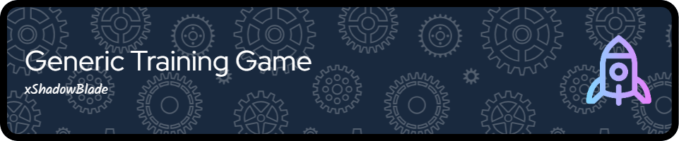

# Overview

This is a simple incremental game / prototype where you train your stats and buy upgrades that increase that gain.
This game currently features only one "reset layer", and involves a lot of waiting (there is offline progress), so it is not your traditional incremental game.

> [!NOTE]
> This game is still in development, so expect bugs, unfinished features, poor balancing as a result of lack of playtesting, and/or data loss.

> [!WARNING]
> The purpose of this game is for me to test the functionality of my [library](https://github.com/xShadowBlade/emath.js).
> As such, development may discontinue at any time.

# Useful links
 - [Changelog](./CHANGELOG.md)